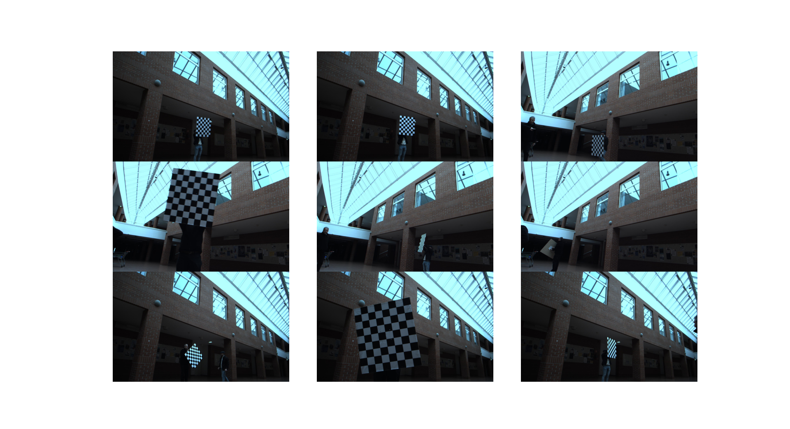
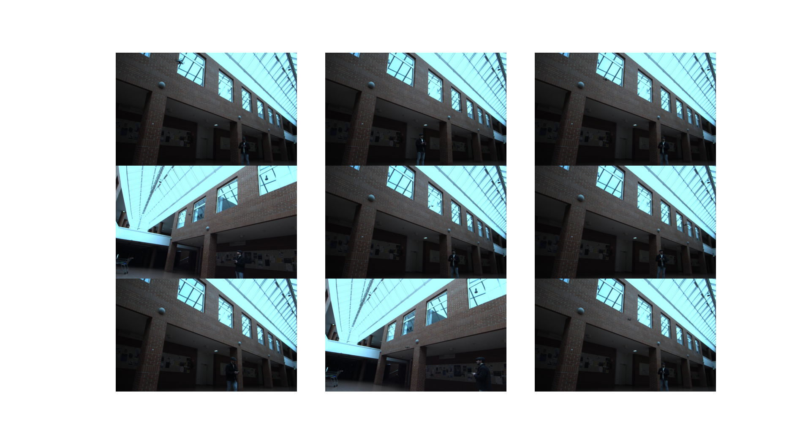

# Stereo Vision Drone Localization Datasets

Welcome to the Stereo Vision Drone Localization Datasets repository! This unique collection consists of two valuable datasets for anyone engaged in the field of drone navigation and stereo vision applications.

## Datasets Overview

There are two main components in this collection:

1. **Stereo Vision Drone Recording**: This dataset showcases the use of stereo vision for the purpose of drone localization. It captures the intricate details of the drone's environment, offering a real-world scenario for testing and improving drone navigation algorithms.

2. **Stereo Camera System Calibration**: This dataset is crucial for those looking to understand and utilize the calibration process for stereo vision systems. It includes images of a checkerboard pattern captured from various angles, facilitating the calibration of stereo camera setups.

## Dataset Structure

The repository is organized into two main directories:

```
/stereo-vision-drone-localization-dataset
    /Calibration
        /dev0
        /dev1
    /Recording
        /dev0
        /dev1
```

### Calibration

The `Calibration` directory contains recordings from two camera devices (`dev0` and `dev1`), each capturing images of a checkerboard pattern from different angles. The size of each cell in the checkerboard is 10cm x 10cm, ideal for calibration purposes.

### Recording

The `Recording` directory includes a stereo recording of a DJI Tello drone, consisting of 368 frames captured at a rate of 5 FPS. This provides a comprehensive set of data for testing stereo vision algorithms in drone localization tasks.

## Visual Overview


*Calibration Images*


*Drone Recording Images*

## Camera and Lenses Specifications

The stereo cameras used for these recordings are the MV-CA020-20GM/GC, paired with SV-0614H lenses, providing high-quality imaging for accurate localization and calibration.

## Usage

These datasets are intended for academic and research purposes, particularly in the areas of drone navigation, stereo vision, and camera calibration. We hope they will prove to be a rich resource for developing and testing new algorithms and techniques in these fields.

## Contribution

Contributions are highly encouraged. If you have relevant data that could enhance this collection or improve the results of stereo vision localization tasks, please feel free to submit a pull request.


Thank you for visiting our repository, and we wish you success in your research and development projects involving stereo vision and drone localization!
